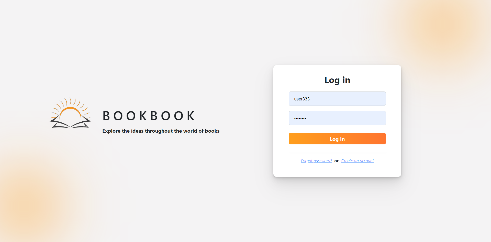
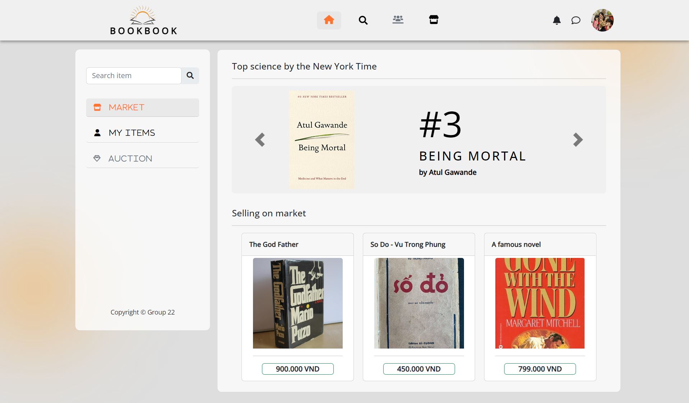
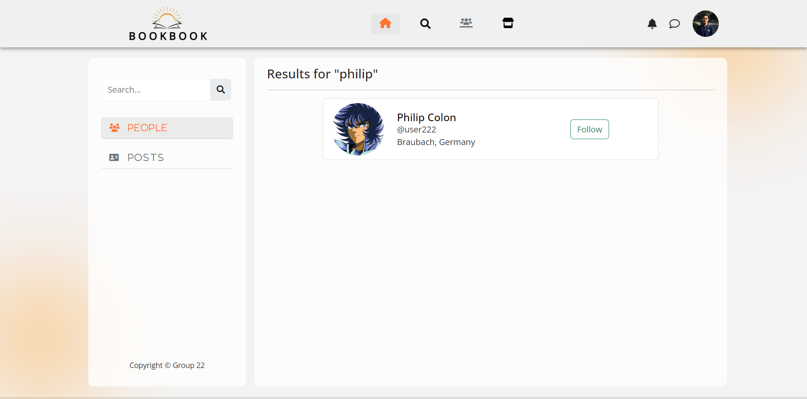
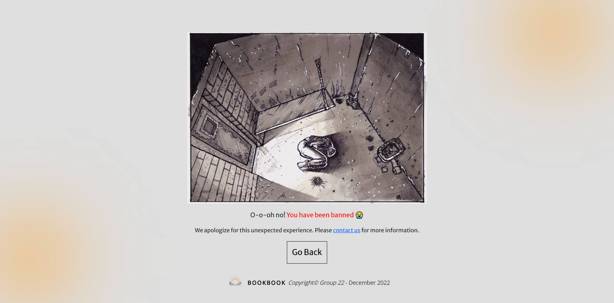
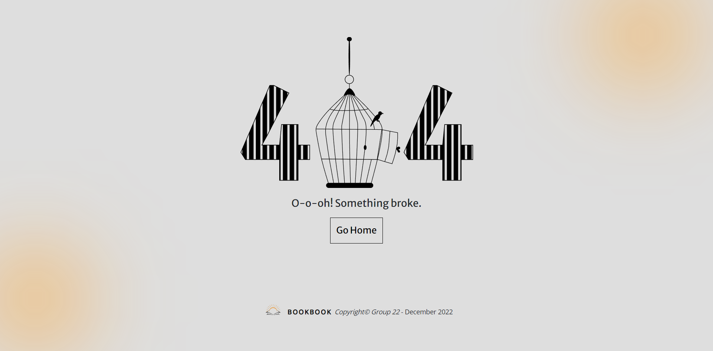

# BookBook 1.0

A simple social media application for people who love books - developed using Node, Express, Handlebars, Postgresql.

## Features

- Login/registration and user authentication.
- User Profile system.
- Newfeed system.
- Market system.
- User actions : follow/unfollow others user, searching ,react/comment on posts, new posts, delete/edit posts,edit profile, report users/posts, sell/buy books.
- Social Admin actions: view reported posts/users, remove reported posts, ban reported user.
- Book club system (not done yet).
- Chatting (not done yet).
- Notifications (not done yet).

## Demo

### Login/Signup

### Profile

### Newfeed

### Market

### Searching

### Banned/404

